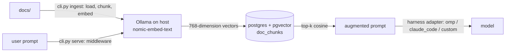

# rag-pipeline-plugin

> **Work in progress:** not yet operational, see [Project Status](#project-status).

Retrieval Augmented Generation (RAG) data pipeline for ingesting documentation and serving context to an AI agent.

Ingest documentation into PostgreSQL with pgvector, retrieve the chunks with the closest embedding vectors to the user prompt, and inject them into the agent harness when calling the model.

Once integrated into your agent harness, every user prompt that calls a model will use RAG.

**Requirements:** Python 3.11 · PostgreSQL 16 + pgvector · Ollama (`nomic-embed-text`, local) · Docker Compose




## Design

- **Always inject.** Every prompt gets retrieval. There is no model-side MCP tool call for when to look things up.
- **Tune with `config.toml`.** Top-k and the embedding model are adjustable without rebuilding anything.
- **Local embeddings.** Ollama runs `nomic-embed-text` (768-dimension vectors), so no documents/chunks leave the machine.
- **"Header-Aware" chunking** instead of fixed chunk sizes, chunks follow the document's own sections. *(planned)*
- **Middleware as a plugin registry.** Each harness gets an adapter in `middleware/adapters/`.


## User Guide | Installation

Requires Docker Engine, Docker Compose plugin, Ollama, and Python 3.11+.
**GUI for viewing the PostgreSQL database recommended.**

Clone the repo and set active directory.
```bash
git clone https://github.com/geomux/rag-pipeline-plugin
cd rag-pipeline-plugin
```
Create a virtual environment and install dependencies.
```bash
python -m venv .venv
source .venv/bin/activate      # Windows: .venv\Scripts\activate
python -m pip install -r requirements.txt
```
Install the embedding model on your machine.
```bash
ollama pull nomic-embed-text
```
Copy the example .env file to a functional .env, then change the password and username values in the new .env to your real access and identity credentials.
```bash
cp .env.example .env
```
Start the database.
```bash
docker compose up -d
```
Copy your documents into the docs/ directory.


## User Guide | Configuration

| File | Holds |
| ---- | ----- |
| `config.toml` | Pipeline tuning: `top_k` (chunks retrieved per prompt) and the Ollama embedding `model` |
| `.env` | Database login: `POSTGRES_DB`, `POSTGRES_USER`, `POSTGRES_PASSWORD` (never committed) |

Changing the embedding model also requires matching `vector(N)` in `store/schema.sql` and re-ingesting all documents. (Default is 768-dim vectors.)


## User Guide | Operation

Available now:

| Command | What it does |
| ------- | ------------ |
| `docker compose up -d` | Start the PostgreSQL + pgvector container |
| `docker compose logs -f postgres` | Tail the database logs |
| `docker compose down` | Stop and remove the container (data is kept in the local `data/postgres/` folder) |

To reset to an empty database, stop the container, delete the data folder, and start it again:
```bash
docker compose down
rm -rf data/postgres
docker compose up -d
```

Planned (commands are wired in `cli.py`; their modules are not built yet):

| Command | What it does |
| ------- | ------------ |
| `python cli.py ingest ./docs` | Chunk, embed, and upsert documents from `docs/` into the vector store |
| `python cli.py retrieve "{prompt}"` | Run a one-off retrieval to confirm top-k results before wiring a harness |
| `python cli.py serve {harness}` | Start the Middleware endpoint the agent harness connects to |


## Repo Layout

Files marked *(planned)* do not exist yet.

| Root | Purpose |
| ---- | ------- |
| `config.toml` | Pipeline tuning: top-k and embedding model |
| `cli.py` | Command-line entry point: `ingest`, `retrieve`, `serve` |
| `docker-compose.yaml` | Runs PostgreSQL + pgvector in one container |
| `ingest/` | Subpackage containing document ingestion modules |
| `store/` | Subpackage containing the Postgres/pgvector schema and connection helper |
| `retrieve/` | Subpackage containing top-k similarity search against the vector store *(planned)* |
| `middleware/` | Subpackage containing the harness adapter protocol and per-harness plugins *(planned)* |

| ingest/ | Purpose |
| ------- | ------- |
| `loader.py` | Walks the docs/ directory and reads source files into memory *(planned)* |
| `chunker.py` | Splits loaded documents into embeddable chunks *(planned)* |
| `embed.py` | Calls the local Ollama embedding model on each chunk |
| `upsert.py` | Writes chunks + embeddings into the pgvector table *(planned)* |

| store/ | Purpose |
| ------ | ------- |
| `schema.sql` | Postgres table + pgvector index definition (`doc_chunks`) |
| `db.py` | Connection helper shared by ingest/ and retrieve/ |

| retrieve/ | Purpose |
| --------- | ------- |
| `query.py` | Embeds the user prompt and runs top-k cosine similarity search *(planned)* |

| middleware/ | Purpose |
| ----------- | ------- |
| `__init__.py` | Adapter protocol every harness plugin implements *(planned)* |
| `registry.py` | Maps harness name to its adapter implementation *(planned)* |
| `adapters/omp.py` | Adapter for the OMP agent harness *(planned)* |
| `adapters/claude_code.py` | Adapter for Claude Code *(planned)* |
| `adapters/custom_cli.py` | Adapter for a custom/personal harness *(planned)* |


## Related Repos

- [mcp-sandbox-setup](https://github.com/geomux/mcp-sandbox-setup)
- [mcp-server-remote](https://github.com/geomux/mcp-server-remote)
- [mcp-client-console](https://github.com/geomux/mcp-client-console)


## Project Status

- [x] Write `cli.py` command routing
- [x] Run PostgreSQL + pgvector with Docker Compose
- [x] `store/`: schema and connection helper
- [x] `ingest/embed.py`: local Ollama embeddings
- [ ] `ingest/`: loader, chunker, upsert
- [ ] Build retrieve/ module
- [ ] Build middleware/ module
- [ ] Add `app` service and Dockerfile to Docker Compose
- [ ] Test document ingesting into vector database
- [ ] Test connecting middleware adapter to an agent harness client
- [ ] Adjust control dial for Top-K to test different augmented retrieval
