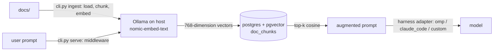

# rag-pipeline-plugin

# *WORK IN PROGRESS* **Repo is not currently operational (see project status)**

Retrieval Augmented Generation (RAG) data pipeline for ingesting documentation and serving context to an AI agent.

Ingest documentation with pgvector/pgvector-scale, retrieve chunks with aligned embedding vectors to the user prompt, inject them into the agent harness when calling the model. 

Once integrated into your agent harness, every user prompt that calls a model will use RAG.


**embedding is completed with a local Ollama run embedding model**




## User Guide | Installation

Requires Docker Engine, Docker Compose plugin, Ollama.
**GUI for viewing the PostresSQL database recommended.**
Requires Python 3.11+.

Clone the repo and set active directory.
```bash
git clone https://github.com/geomux/rag-pipeline-plugin
cd rag-pipeline-plugin
```
Create a virtual environment and install dependencies.
```bash
python -m venv .venv
source .venv/bin/activate      # Windows: .venv\Scripts\activate
python -m pip install -r requirements.txt
```
Install the embedding model on your machine.
```bash
ollama pull nomic-embed-text
```
Move the example .env file to a functional .env.
```bash
cp .env.example .env
```
Change the password value in the new .env to your real database access password.


Copy your documents into docs/ directory.


## User Guide | Configuration


## User Guide | Operation


| Command                                       | What it does                                  |
| --------------------------------------------- | --------------------------------------------- |
| `sudo docker compose up -d --build`   | Build images and start containers |
| `docker compose exec app python cli.py ingest ./docs` | Chunk, embed, and upsert documents from `docs/` into the vector store |
| `docker compose exec app python cli.py query "{prompt}"` | Run a one-off retrieval to confirm top-k results before wiring a harness |
| `docker compose exec app python cli.py serve` | Start the middleware endpoint agent harnesses connect to |
| `docker compose logs -f app` | Tail the middleware/ingest logs |
| `docker compose down` | Stop and remove containers |


## User Guide | Connecting a Client (mcp-client-console)

Connect to a Agent Harness (MCP Client), such as OMP, Claude Code, or mcp-client-console.


## Repo Layout

| Root                 | Purpose                                                              |
| -------------------- | -------------------------------------------------------------------- |
| `config.toml` | Pipeline config, mounted into the container, holds Top-K dial |
| `cli.py`  |   Handles RAG ingestion and injection |
| `docker-compose.yaml` |   Builds compose docker containers for postegres and pgvector |
| `ingest/` |    Subpackage containing resource injection modules |
| `store/` |    Subpackage containing the Postgres/pgvector schema and connection/query helpers |
| `retrieve/` |    Subpackage containing top-k similarity search against the vector store |
| `middleware/` |    Subpackage containing the harness adapter protocol and per-harness plugins |

| ingest/                 | Purpose                                                              |
| -------------------- | -------------------------------------------------------------------- |
| `loader.py` | Walks the docs/ directory and reads source files into memory |
| `chunker.py` | Splits loaded documents into embeddable chunks |
| `embed.py` | Calls the local Ollama embedding model on each chunk |
| `upsert.py` | Writes chunks + embeddings into the pgvector table |

| store/                 | Purpose                                                              |
| -------------------- | -------------------------------------------------------------------- |
| `schema.sql` | Postgres table + pgvector index definition (`doc_chunks`) |
| `db.py` | Connection pool and query helpers shared by ingest/retrieve |

| retrieve/           |  Purpose                                                              |
| -------------------- | -------------------------------------------------------------------- |
| `query.py` | Embeds the user prompt and runs top-k cosine similarity search |

| middleware/                 | Purpose                                                              |
| -------------------- | -------------------------------------------------------------------- |
| `__init__.py` | Adapter protocol every harness plugin implements |
| `registry.py` | Maps harness name to its adapter implementation |
| `adapters/omp.py`  |  Adapter for the OMP agent harness |
| `adapters/claude_code.py`  |  Adapter for Claude Code |
| `adapters/custom_cli.py`  |  Adapter for a custom/personal harness |


## Related / Required Repos

- [mcp-sandbox-setup](https://github.com/geomux/mcp-sandbox-setup)
- [mcp-server-remote](https://github.com/geomux/mcp-server-remote)
- [mcp-client-console](https://github.com/geomux/mcp-client-console)


## Project Status

- [x] Write cli orchestrator and docker compose pieces
- [x] Build ingest/ module
- [x] Build store/ module
- [ ] Build retrieve/ module
- [ ] Build middleware/ module
- [ ] Test document ingesting into vector database
- [ ] Test connecting middleware adapter to an agent harness client
- [ ] Adjust control dial for Top-K to test different augmented retrieval

